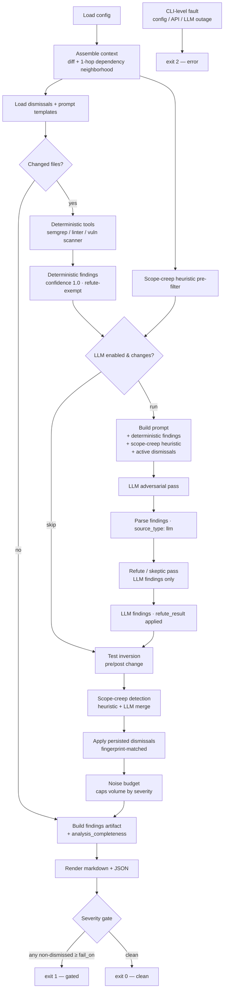
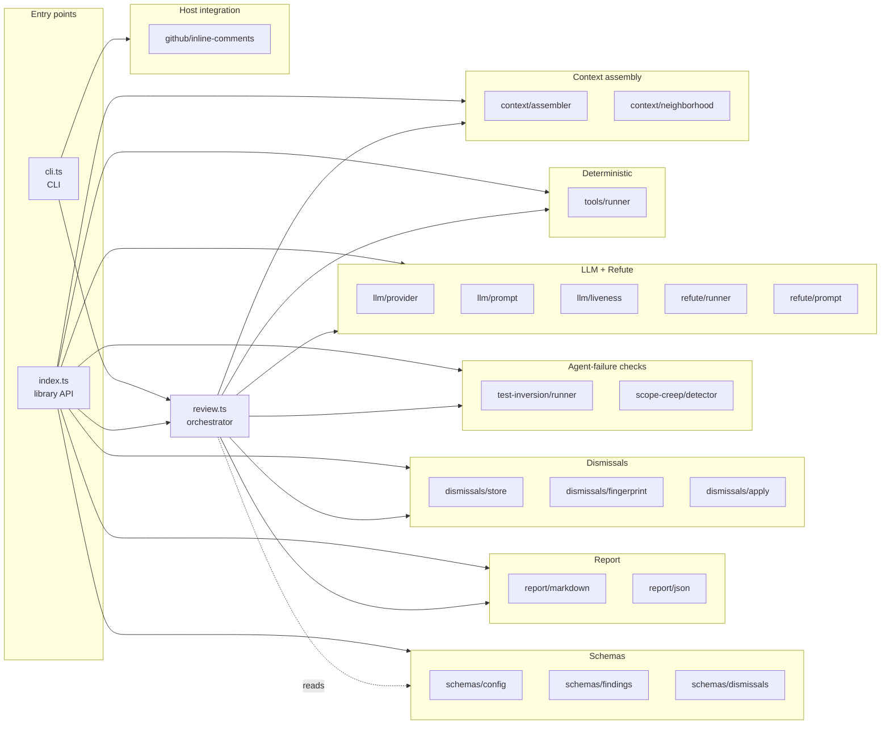
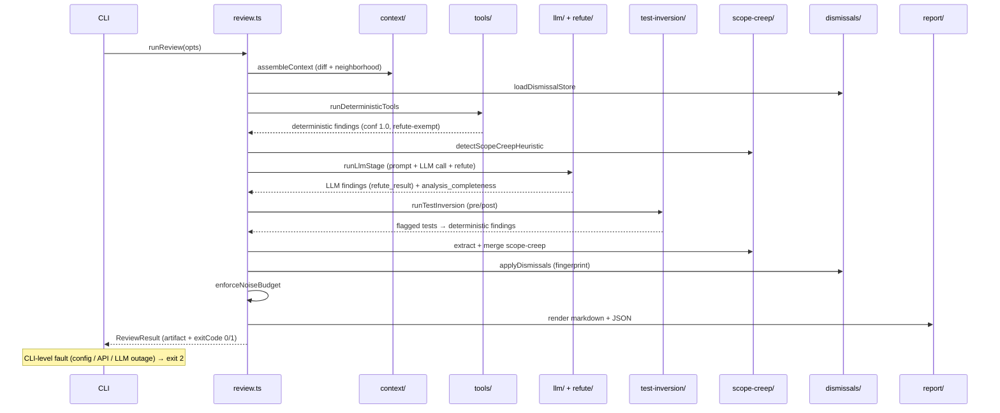

# Architecture

Flaught runs an adversarial review pipeline: a deterministic-first pass (semgrep, linter, vuln scanner, test inversion, scope-creep heuristic) grounds an LLM adversarial review, which is then tested by a skeptic/refute pass. Findings are source-tagged (`deterministic` vs `llm`), pooled, run through a noise budget and a severity gate, and emitted as a Markdown PR comment plus a versioned JSON artifact.

This page is the human-readable architecture reference: the pipeline, the component map, and a single-run sequence. For the CI trust-zone flow (fork-PR split, privileged/unprivileged workflows), see [`github-actions.md`](./github-actions.md) — it's not duplicated here.

> **Plain-text / non-rendering viewers:** each diagram has an ASCII fallback directly below the rendered (mermaid) version. GitHub renders mermaid natively; in a plain `cat` or a renderer without mermaid, read the ASCII block.

---

## 1. The pipeline (the real branching version)

The README's one-line diagram is linear; the actual pipeline branches. Deterministic findings get `confidence: 1.0` and are **exempt from the refute pass** (treated as ground truth — the roadmap's [Artifact honesty](./roadmap.md) theme revisits this). Dismissals apply *before* the noise budget so a re-surfaced dismissed finding never crowds out a new one. The noise budget caps volume; the severity gate decides the exit code. A CLI-level fault (bad config, missing API key, LLM outage) is **exit 2** — a tool problem, not a verdict on the code, and never blocks merge.



```
Config → Context (diff + 1-hop neighborhood)
         ├─ Deterministic tools ─→ findings (conf 1.0, refute-EXEMPT) ─┐
         ├─ Scope-creep heuristic ────────────────────────────────────┐ │
         │                                                            │ │
         └─ LLM pass (prompt = diff + deterministic + scope-creep    ◄┘ │
              heuristic + active dismissals)                          │
              ├─ parse → source_type: llm                             │
              └─ Refute/skeptic (LLM ONLY; deterministic exempt) ─────┤ │
                                                                      ▼ ▼
         Test inversion (pre/post) → deterministic findings ──────────► pool
         Scope-creep merge (heuristic + LLM) ─────────────────────────► pool
         Apply persisted dismissals (fingerprint) ────────────────────► pool
         Noise budget (caps volume by severity) ──────────────────────► trimmed
         Build artifact (+ analysis_completeness) ────────────────────► artifact
         Render markdown + JSON
         Severity gate:
            any non-dismissed finding ≥ fail_on → exit 1 (gated)
            clean → exit 0
            * CLI-level fault (config/API/LLM outage) → exit 2 (error, not a verdict)
```

---

## 2. Component map

`src/review.ts` is the orchestrator that wires the stages. The library entry is `src/index.ts` (re-exports the public API); the CLI is `src/cli.ts`. Modules are grouped by pipeline role below.



```
Entry points
  cli.ts            Commander CLI (review / dismiss / init / dashboard)
  index.ts          library API — re-exports runReview() + the composable pieces

Orchestrator
  review.ts         runReview() — wires the 5 stages, gates, exit code
                    runLlmStage() — LLM + refute, decoupled from the checkout
                    (powers both the live review and the fork-PR --only-llm half)

Context assembly
  context/assembler.ts     diff + changed files + file contents
  context/neighborhood.ts  1-hop dependency graph (blast radius)

Deterministic tools
  tools/runner.ts          semgrep / linter / vuln scanner — source_type: deterministic

LLM + Refute
  llm/provider.ts          OpenAI-compatible / Anthropic / Groq / Gemini / Ollama
  llm/prompt.ts            system + user prompt, analysis_completeness tracking
  llm/liveness.ts          pre-flight model-exists check
  refute/runner.ts         skeptic pass — tries to refute LLM findings
  refute/prompt.ts         refute system/user prompt

Agent-failure checks
  test-inversion/runner.ts  pre/post-change test sensitivity
  scope-creep/detector.ts   heuristic + LLM scope-creep

Dismissals
  dismissals/store.ts       load/save .flaught-dismissals.json
  dismissals/fingerprint.ts stable SHA-256 identity across rephrasings
  dismissals/apply.ts       fingerprint-matched suppression (before noise budget)

Schemas (Zod)
  schemas/config.ts         .advreview.yml shape + defaults
  schemas/findings.ts       artifact / finding / severity / source_type / caveat
  schemas/dismissals.ts     dismissal entry + store

Report
  report/markdown.ts        PR comment render
  report/json.ts            versioned JSON artifact

Host integration
  github/inline-comments.ts inline PR comments (GitHub today; host adapters coming — roadmap Portability)
```

---

## 3. Single-run sequence

One `runReview()` call, end to end. The refute pass runs **only on LLM findings**; deterministic and test-inversion findings carry `refute_result: null`. `analysis_completeness` is recorded on the artifact so "review completed" is never mistaken for "comprehensively reviewed" (see the [honest caveat](../README.md#honest-caveat)).



```
CLI --runReview()--> review.ts
  review.ts --> context/      : assembleContext (diff + neighborhood)
  review.ts --> dismissals/   : loadDismissalStore
  review.ts --> tools/        : runDeterministicTools
  tools/    --> review.ts     : deterministic findings (conf 1.0, refute-exempt)
  review.ts --> scope-creep/  : detectScopeCreepHeuristic
  review.ts --> llm/+refute/  : runLlmStage (prompt + LLM call + refute)
  llm/+refute/ --> review.ts  : LLM findings (refute_result) + analysis_completeness
  review.ts --> test-inversion/ : runTestInversion (pre/post)
  test-inversion/ --> review.ts : flagged tests → deterministic findings
  review.ts --> scope-creep/  : extract + merge scope-creep
  review.ts --> dismissals/   : applyDismissals (fingerprint)
  review.ts --> review.ts     : enforceNoiseBudget
  review.ts --> report/       : render markdown + JSON
  review.ts --> CLI           : ReviewResult (artifact + exitCode 0/1)
  * CLI-level fault (config/API/LLM outage) → exit 2
```

---

## 4. The fork-PR review split

For PRs from forks, GitHub withholds secrets and gives a read-only token, so the LLM pass can't run inline. Flaught splits the pipeline into an **unprivileged** half (deterministic only, emits a context bundle as data) and a **privileged** half (`--only-llm`, runs the LLM + refute against the diff carried as data, never executing the fork's code). The full trust-zone diagram and the two workflows live in [`github-actions.md`](./github-actions.md). The split reuses `runLlmStage()` — the same code path backs the monolithic `flaught review` and the artifact-driven `flaught review --only-llm`.

---

## 5. Exit codes

| Code | Meaning | Who produces it |
| --- | --- | --- |
| `0` | Clean — no non-dismissed findings at/above `severity_gate.fail_on` | `computeExitCode()` in `review.ts` |
| `1` | Gated — a non-dismissed finding meets the threshold | `computeExitCode()` in `review.ts` |
| `2` | Error — config/API/LLM fault (a tool problem, not a code verdict; recommended CI handling: warn, don't block) | `cli.ts`, on a thrown fault |

See the [README exit-codes table](../README.md#exit-codes) and [exit-code handling](./github-actions.md#exit-code-handling).

---

## 6. Design principles

- **Deterministic-first.** Semgrep/linter/vuln-scanner run *before* the LLM, grounding the review in facts. Findings are tagged `source_type: "deterministic"` vs `"llm"` so provenance is always visible.
- **Refute exemption is deliberate (and under review).** Deterministic findings get `confidence: 1.0` and skip the skeptic pass as "ground truth." The [Artifact honesty](./roadmap.md) theme revisits this — deterministic tools have false-positive rates too, and the skeptic should be able to *contextualize* (not dismiss) them.
- **Honest caveat.** Every artifact carries `_caveat`: evidence that scrutiny *occurred*, not that findings are *correct*. `analysis_completeness` records whether the LLM saw the whole change.
- **Gate is config, not prescription.** The noise budget and `fail_on` threshold are per-project config; whether the status check is *required* is repo branch-protection, not tool default behavior. See the roadmap's [Gate integrity](./roadmap.md) theme.
- **Cache vs determinism.** LLM findings are a non-reproducible sample across runs (temperature, provider nondeterminism). The fingerprint — not the run-local `F-000N` id — is the stable cross-run identifier. See the roadmap's gate-integrity / determinism work.

---

*See also: [Website](https://flaught.github.io) · [Configuration](./configuration.md) · [Findings schema](./findings-schema.md) · [Prompt templates](./prompt-templates.md) · [Dismissals](./dismissals.md) · [GitHub Actions](./github-actions.md) · [Roadmap](./roadmap.md) · [Programmatic API](./api.md)*